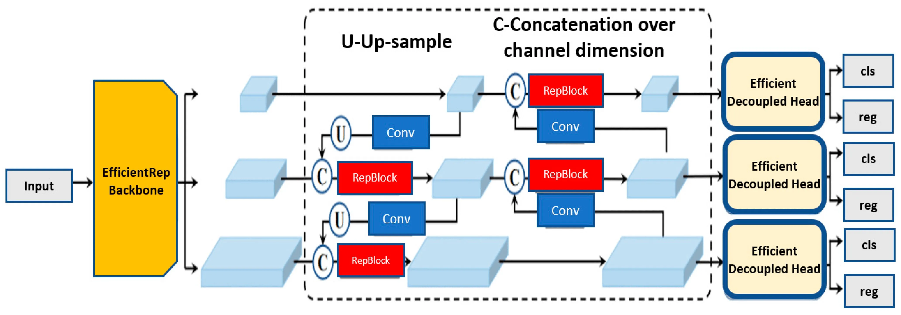
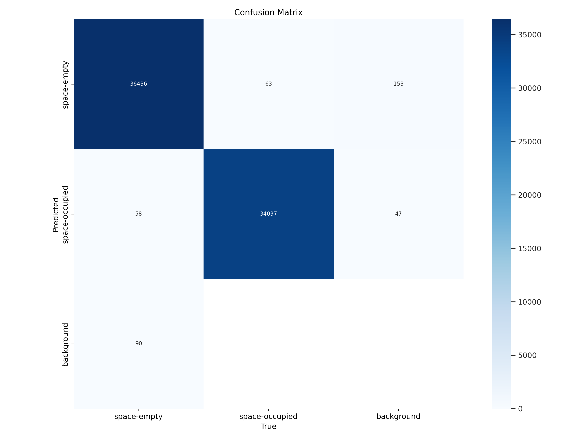

# Object Detection: Parking Spot

This applications focuses on object detection for parking spot availability using the YOLO (You Only Look Once) V8 architecture. The dataset consists of annotated parking lot images under various weather conditions, with classes identifying empty and occupied parking spaces.

## Table of Contents
- [Introduction](#introduction)
- [Data](#data)
- [Methods](#methods)
- [Results](#results)
  - [Evaluation Metrics](#evaluation-metrics)
  - [Confusion Matrix](#confusion-matrix)
  - [Visualizations](#visualizations)
- [Directory Structure](#directory-structure)
- [Installation](#installation)
  - [Conda Environment Setup](#conda-environment-setup)
  - [Docker Setup (Optional)](#docker-setup-optional)
- [Usage](#usage)
  - [Run Main Script](#run-main-script)
  - [Run Each Source Script (Optional)](#run-each-source-script-optional)
    - [Data Preparation](#data-preparation)
    - [Training](#training)
    - [Evaluation](#evaluation)
    - [Inference](#inference)

## Introduction

The application uses YOLO V8, a state-of-the-art object detection model, to classify parking spaces as either occupied or empty, offering real-world benefits in smart parking systems, traffic management, and resource optimization.

The provided dataset includes labeled images of parking lots captured under different weather conditions. The labels identify parking spaces as either occupied or empty using bounding boxes.

The results demonstrate the high performance of the pre-trained YOLO V8 model for parking space detection. Below are six examples of ground truth labels (left) and model-predicted detections (right), which illustrate the model’s capability to accurately detect parking spaces as either occupied (red) or empty (blue), closely matching the labeled ground truth:


## Data

The dataset is PKLot, which contains 12,416 images of parking lots extracted from surveillance camera frames. These images include variations in weather conditions, such as sunny, cloudy, and rainy days. Each parking space is labeled as either occupied or empty. Annotations from the original dataset were converted to standard object detection formats with bounding boxes enclosing the rotated rectangles.

The PKLot database is licensed under the Creative Commons Attribution 4.0 License. For more infomration, visit [the dataset summary on Roboflow](https://public.roboflow.com/object-detection/pklot).

> Almeida, P., Oliveira, L. S., Silva Jr, E., Britto Jr, A., Koerich, A., PKLot – A robust dataset for parking lot classification, Expert Systems with Applications, 42(11):4937-4949, 2015.

## Methods

YOLO V8 is a powerful object detection model known for its speed and accuracy. It uses advanced architecture to detect objects in images in a single forward pass, making it suitable for real-time applications. For more details, visit [the YOLO documentation](https://docs.ultralytics.com/).



*Figure from [PRINCIPLES OF YOLO V8 by Muhammad Taha Ilyas](https://medium.com/@m.tahailyas786/principles-of-yolo-v8-3c605eab9bcc).*

> Redmon, J., Divvala, S., Girshick, R., & Farhadi, A. (2016). You Only Look Once: Unified, Real-Time Object Detection. CVPR.  
  [Paper link](https://arxiv.org/abs/1506.02640)

> Wang, C.-Y., Bochkovskiy, A., & Liao, H.-Y. M. (2021). Scaled-YOLOv4: Scaling Cross Stage Partial Network. CVPR.  
  [Paper link](https://arxiv.org/abs/2011.08036)

## Results

The model was evaluated on the test dataset, consisting of 1,242 images and 70,684 instances. Below is a summary of the results:

### Evaluation Metrics
- **Precision**: 0.9978
- **Recall**: 0.9972
- **mAP@0.5**: 0.9941
- **mAP@0.5:0.95**: 0.9707

These metrics highlight the effectiveness of the model in identifying both empty and occupied parking spaces under varying conditions.

### Confusion Matrix
The confusion matrix provides a visual representation of the model's performance, indicating the number of true positives, false positives, and false negatives for each class. Below is the confusion matrix from the evaluation:



### Visualizations
Additionally, the evaluation includes visualizations of precision-recall curves, confidence-based F1, precision, and recall plots. These can be found in the `results/evaluation/` directory, and are useful for understanding the model's behavior across various confidence thresholds.

## Directory Structure

```
object-detection-parking-spot/
├── configs/                      # Pre-trained YOLO V8 weight files
├── data/                         # Dataset
│   ├── preprocessed/             # Preprocessed dataset with labels and images
│   └── raw/                      # Raw downloaded ZIP file
├── Dockerfile                    # Docker setup
├── environment.yml               # Conda environment setup
├── examples.png                  # Summary figures of example visualizations
├── LICENSE                       # Project license
├── main.py                       # Main pipeline script
├── README.md                     # Project README
├── requirements.txt              # Python dependencies
├── results/                      # Outputs from inference and evaluation
│   ├── evaluation/               # Evaluation-specific files
│       ├── confusion_matrix.png  # Confusion matrix visualization
│       ├── confusion_matrix_norm.png # Normalized confusion matrix
│       ├── F1_curve.png          # F1 curve visualization
│       ├── P_curve.png           # Precision-confidence curve
│       ├── PR_curve.png          # Precision-Recall curve visualization
│       └── R_curve.png           # Recall-confidence curve
│   ├── evaluation_metrics.txt    # Evaluation metrics summary
│   ├── ground_truth_*.png        # Ground truth visualizations
│   └── predicted_detection_*.png # Model prediction visualizations
├── src/                          # Source code
│   ├── data.py                   # Data preparation script
│   ├── eval.py                   # Evaluation script
│   ├── infer.py                  # Inference script
│   └── train.py                  # Training script
└── yolov8.png                    # Illustration of YOLO V8
```

## Installation

### Conda Environment Setup

1. Clone the repository:
   ```bash
   git clone https://github.com/your-ai-solution/object-detection-parking-spot.git
   cd object-detection-parking-spot
   ```

2. Create a Conda environment:
   ```bash
   conda env create -f environment.yml
   conda activate object-detection-parking-spot
   ```

3. Install dependencies:
   ```bash
   pip install -r requirements.txt
   ```

### Docker Setup (Optional)

1. Build the Docker image:
   ```bash
   docker build -t object-detection-parking-spot .
   ```

2. Run the Docker container:
   ```bash
   docker run --gpus all -v $(pwd)/data:/app/data -v $(pwd)/results:/app/results object-detection-parking-spot
   ```

##  Usage

### Run Main Script

1. Place [the dataset ZIP](https://public.roboflow.com/object-detection/pklot/2) in `data/raw/`. 

2. Run the main script that automates the entire pipeline:
   ```bash
   python main.py
   ```

### Run Each Source Script (Optional)

1. Data preparation: Preprocess the dataset.
   ```bash
   python src/data.py
   ```

2. Training: Train a YOLO V8 model.
   ```bash
   python src/train.py
   ```

3. Evaluation: Evaluate the YOLO V8 model.
   ```bash
   python src/eval.py
   ```

4. Inference: Run inference on random test images.
   ```bash
   python src/infer.py
   ```